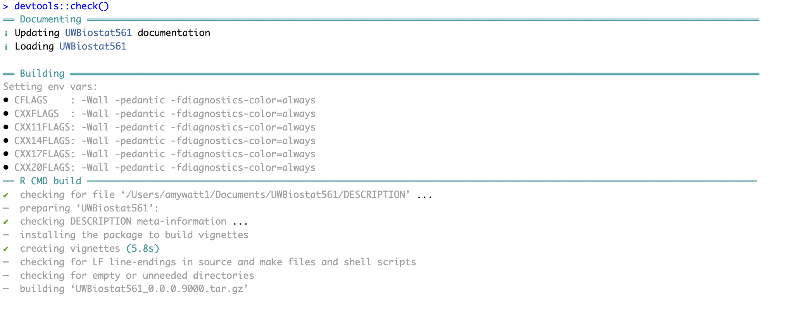
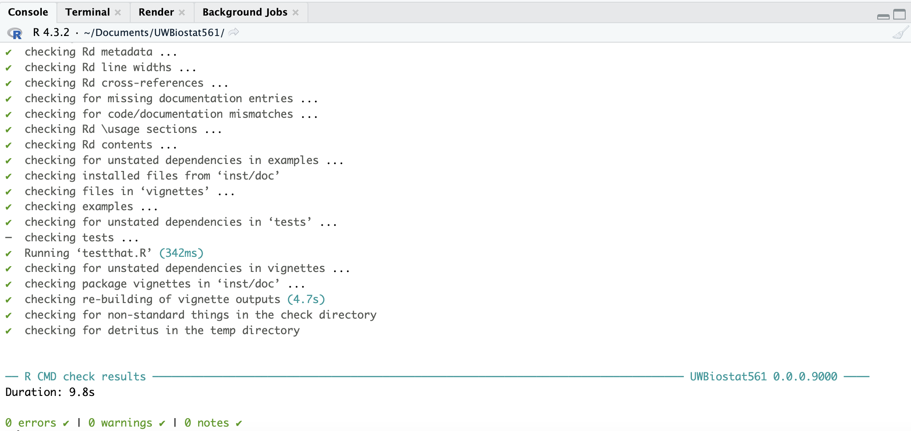

```{r, include = FALSE}
knitr::opts_chunk$set(
  collapse = TRUE,
  comment = "#>"
)
```

```{r setup, include = FALSE}
library(devtools)
library(tidyverse)
library(bookdown)
library(ggplot2)
library(UWBiostat561)
```

## Disclosures

I used ChatGPT to generate the check input functions and the starting code for both generating random graphs and finding maximal partial cliques. 

## Question 1 

### Question 1A

### Question 1B

### Question 1C

### Question 1D

```{r}
set.seed(10)
simulation <- UWBiostat561::generate_partial_clique(
  n = 10,
  clique_fraction = 0.5,
  clique_edge_density = 0.9
)

simulation$adj_mat
```

## Question 2

### Question 2A

### Question 2B

### Question 2C

```{r}
set.seed(0)
simulation <- UWBiostat561::generate_partial_clique(
  n = 30,
  clique_fraction = 0.5,
  clique_edge_density = 0.9
)

adj_mat <- simulation$adj_mat

res <- UWBiostat561::compute_maximal_partial_clique(
  adj_mat = adj_mat,
  alpha = 0.9
)
res

system.time(UWBiostat561::compute_maximal_partial_clique(
  adj_mat = adj_mat,
  alpha = 0.9
))
```

## Question 3

### Question 3A

### Question 3B

### Question 3C

### Question 3D

## Question 4

### Question 4A

### Question 4B

### Question 4C

```{r}


```

### Question 4D

```{r}
devtools::session_info()
```

## Question 5

### Question 5A

I can access OpenSesame.

### Question 5B
