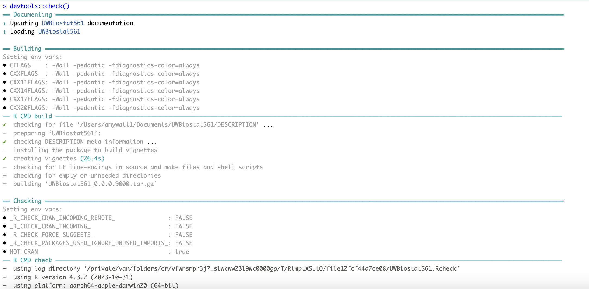
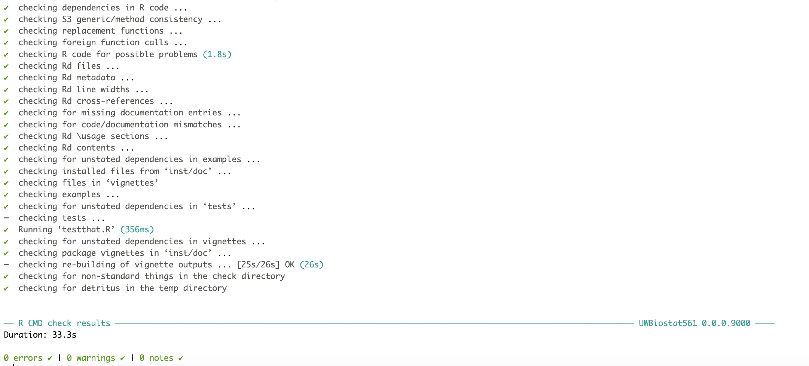

```{r, include = FALSE}
knitr::opts_chunk$set(
  collapse = TRUE,
  comment = "#>"
)
```

```{r setup}
library(UWBiostat561)
library(testthat)
```

## Disclosures

## Question 1 

### Question 1A

### Question 1B

Implementation 8: This first checks if the given matrix is diagonal, in which case none of the nodes are connected and the result is 1. Otherwise, the function returns the first node that is connected to at least one other node. 

Implementation 10: This function starts with a list of all nodes and removes nodes one by one and stores the result as the largest partial clique if the restricted list of nodes satisfies alpha. 

### Question 1C

Implementation 8: The code is easy to read, comments describing some of the major parts of the functions in words would make it easier to understand to someone who did not write the code. 

Implementation 10: Comments within the function describing the major parts are helpful for readability. 

### Question 1D

```{r, error = TRUE}
testthat::test_that("compute_maximal_partial_clique8 works", {
  set.seed(10)

  # Mock data and parameters for testing
  n <- 20
  clique_fraction <- c(0.2, 0.4, 0.6, 0.8, 0.2, 0.4, 0.6, 0.8, 0.2, 0.4, 0.6, 0.8)
  clique_edge_density <- c(0.2, 0.2, 0.2, 0.2, 0.5, 0.5, 0.5, 0.5, 0.8, 0.8, 0.8, 0.8)
  alpha1 <- 0.6
  alpha2 <- 0.9

  adj_mat_list <- c()
  res1 <- c()
  edge_density1 <- c()
  clique_idx1 <- c()
  res2 <- c()
  edge_density2 <- c()
  clique_idx2 <- c()

  for(i in 1:length(clique_fraction)){
    temp_adj_mat <- generate_partial_clique(n, clique_fraction[i], clique_edge_density[i])
    adj_mat_list <- c(adj_mat_list, list(temp_adj_mat$adj_mat))

    temp_max_clique1 <- compute_maximal_partial_clique8(temp_adj_mat$adj_mat, alpha1)
    temp_max_clique2 <- compute_maximal_partial_clique8(temp_adj_mat$adj_mat, alpha2)

    res1 <- c(res1, list(temp_max_clique1))
    edge_density1 <- c(edge_density1, temp_max_clique1$edge_density)
    clique_idx1 <- c(clique_idx1, list(temp_max_clique1$clique_idx))

    res2 <- c(res2, list(temp_max_clique2))
    edge_density2 <- c(edge_density2, temp_max_clique2$edge_density)
    clique_idx2 <- c(clique_idx2, list(temp_max_clique2$clique_idx))
  }

  # Test the output format
  expect_true(is.list(res1[[1]]))
  expect_true(is.numeric(res1[[1]]$clique_idx))
  expect_true(is.double(res1[[1]]$edge_density))

  # Test output satisfies edge density
  clique_idx <- res1[[1]]$clique_idx
  adj_mat <- adj_mat_list[[1]]
  m=length(clique_idx)
  expect_true((sum(adj_mat[clique_idx,clique_idx])-m)/2 >= alpha1*m*(m-1)/2)

  # Test the output format for list of mock data with different clique fractions
  for(i in 1:length(res1)) {
    res <- res1[[i]]
    adj_mat <- adj_mat_list[[i]]
    clique_idx <- res$clique_idx
    m=length(clique_idx)
    edge_density <- res$edge_density

    expect_true(is.list(res))
    expect_true(is.numeric(clique_idx))
    expect_true(is.double(edge_density))
    expect_true((sum(adj_mat[clique_idx,clique_idx])-m)/2 >= alpha1*m*(m-1)/2)
  }


  # Test edge densities different for different alpha
  expect_false(sum(edge_density1 == edge_density2) == length(edge_density1))

  # Test clique_idx different for different alpha
  expect_false(sum(unlist(lapply(seq_along(clique_idx1), function(i) identical(clique_idx1[[i]], clique_idx2[[i]])))) == length(clique_idx1))

  # Test edge densities different for same alpha different inputs
  expect_false(length(unique(edge_density1)) == 1)
  expect_false(length(unique(edge_density2)) == 1)

  # Test clique_idx different for same alpha different inputs
  expect_false(length(unique(clique_idx1)) == 1)
  expect_false(length(unique(clique_idx2)) == 1)

  # Test for errors for out of range alpha
  expect_error(compute_maximal_partial_clique8(adj_mat_list[[1]], -1))

  # Test returned edge densities are within expected range
  expect_true(sum(unlist(lapply(seq_along(edge_density1), function(i) edge_density1[i] >= 0 && edge_density1[i] <= 1))) == length(edge_density1))
})
```

```{r, error = TRUE}
testthat::test_that("compute_maximal_partial_clique10 works", {
  set.seed(10)

  # Mock data and parameters for testing
  n <- 20
  clique_fraction <- c(0.2, 0.4, 0.6, 0.8, 0.2, 0.4, 0.6, 0.8, 0.2, 0.4, 0.6, 0.8)
  clique_edge_density <- c(0.2, 0.2, 0.2, 0.2, 0.5, 0.5, 0.5, 0.5, 0.8, 0.8, 0.8, 0.8)
  alpha1 <- 0.6
  alpha2 <- 0.9

  adj_mat_list <- c()
  res1 <- c()
  edge_density1 <- c()
  clique_idx1 <- c()
  res2 <- c()
  edge_density2 <- c()
  clique_idx2 <- c()

  for(i in 1:length(clique_fraction)){
    temp_adj_mat <- generate_partial_clique(n, clique_fraction[i], clique_edge_density[i])
    adj_mat_list <- c(adj_mat_list, list(temp_adj_mat$adj_mat))

    temp_max_clique1 <- compute_maximal_partial_clique10(temp_adj_mat$adj_mat, alpha1)
    temp_max_clique2 <- compute_maximal_partial_clique10(temp_adj_mat$adj_mat, alpha2)

    res1 <- c(res1, list(temp_max_clique1))
    edge_density1 <- c(edge_density1, temp_max_clique1$edge_density)
    clique_idx1 <- c(clique_idx1, list(temp_max_clique1$clique_idx))

    res2 <- c(res2, list(temp_max_clique2))
    edge_density2 <- c(edge_density2, temp_max_clique2$edge_density)
    clique_idx2 <- c(clique_idx2, list(temp_max_clique2$clique_idx))
  }

  # Test the output format
  expect_true(is.list(res1[[1]]))
  expect_true(is.numeric(res1[[1]]$clique_idx))
  expect_true(is.double(res1[[1]]$edge_density))

  # Test output satisfies edge density
  clique_idx <- res1[[1]]$clique_idx
  adj_mat <- adj_mat_list[[1]]
  m=length(clique_idx)
  expect_true((sum(adj_mat[clique_idx,clique_idx])-m)/2 >= alpha1*m*(m-1)/2)

  # Test the output format for list of mock data with different clique fractions
  for(i in 1:length(res1)) {
    res <- res1[[i]]
    adj_mat <- adj_mat_list[[i]]
    clique_idx <- res$clique_idx
    m=length(clique_idx)
    edge_density <- res$edge_density

    expect_true(is.list(res))
    expect_true(is.numeric(clique_idx))
    expect_true(is.double(edge_density))
    expect_true((sum(adj_mat[clique_idx,clique_idx])-m)/2 >= alpha1*m*(m-1)/2)
  }


  # Test edge densities different for different alpha
  expect_false(sum(edge_density1 == edge_density2) == length(edge_density1))

  # Test clique_idx different for different alpha
  expect_false(sum(unlist(lapply(seq_along(clique_idx1), function(i) identical(clique_idx1[[i]], clique_idx2[[i]])))) == length(clique_idx1))

  # Test edge densities different for same alpha different inputs
  expect_false(length(unique(edge_density1)) == 1)
  expect_false(length(unique(edge_density2)) == 1)

  # Test clique_idx different for same alpha different inputs
  expect_false(length(unique(clique_idx1)) == 1)
  expect_false(length(unique(clique_idx2)) == 1)

  # Test for errors for out of range alpha
  expect_error(compute_maximal_partial_clique10(adj_mat_list[[1]], -1))

  # Test returned edge densities are within expected range
  expect_true(sum(unlist(lapply(seq_along(edge_density1), function(i) edge_density1[i] >= 0 && edge_density1[i] <= 1))) == length(edge_density1))
})
```

## Question 2

### Question 2A

```{r}
set.seed(10)
data <- UWBiostat561::generate_partial_clique(n = 10, 
                                            clique_fraction = 0.5,
                                            clique_edge_density = 0.95)

set.seed(10)
result1 <- UWBiostat561::compute_maximal_partial_clique_master(
  adj_mat = data$adj_mat, 
  alpha = 0.95, 
  number = 11, 
  time_limit = 30
)
result1

set.seed(10)
result2 <- UWBiostat561::compute_maximal_partial_clique11(
  adj_mat = data$adj_mat, 
  alpha = 0.95
)
result2
```

```{r}
set.seed(10)
data <- UWBiostat561::generate_partial_clique(n = 50, 
                                            clique_fraction = 0.5,
                                            clique_edge_density = 0.95)

result1 <- UWBiostat561::compute_maximal_partial_clique_master(
  adj_mat = data$adj_mat, 
  alpha = 0.95, 
  number = 1, 
  time_limit = 20
)

result1
```
### Question 2B

Simulation plan: 

- Data generation: I will use the generate clique function from hw3 
- Data randomness: I will vary n = 15/35, clique fractions = 0.6/0.9, and edge densities = 0.6/0.9 and will test on two alpha levels 
- Methods: all 25 on canvas 
- I hope to see trends in methods that calculate the largest clique across the changing parameters 
- 1 trial per level outlined above. 
- 2x2x2x2 = 16 trials per implementation; 16 trials x 0.5 min/trial x 25 implementations / 60 = 3.3 hours

### Question 2C

Wrote simulation function

### Question 2D

Wrote unit tests 

### Question 2E

```{r}


```

## Question 3

### Question 3A

Wrote HW4_simulation_execute.R, HW4_simulation_execute.slurm

### Question 3B

### Question 3C

Ran: 
sbatch HW4_simulation_execute.slurm

### Question 3D

Wrote HW4_simulation_plot.R

### Question 3E

## Question 4

## Question 5
